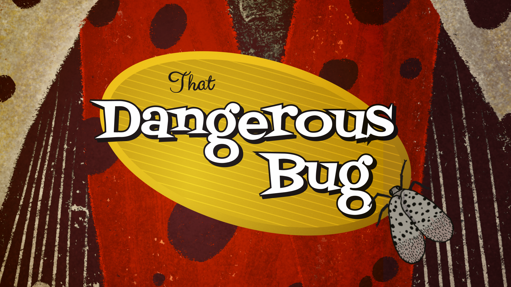

# That Dangerous Bug

A fast-paced bug-smashing survival game where you must defend yourself against waves of increasingly dangerous insects.

## 🎮 How to Play

-   **Tap/Click** to smash bugs before they reach you
-   Keep bugs away from the center circle (you!)
-   If bugs get too close, they'll stick to you and drain your stamina
-   **Tap stuck bugs** multiple times to shake them off
-   Survive as many waves as possible!

## 🐛 Bug Types

-   **Normal**: Basic bugs, easy to smash
-   **Fast**: Quick-moving bugs worth more points
-   **Tank**: Tough bugs that take multiple hits
-   **Splitter**: Splits into smaller bugs when smashed
-   **Boss**: Appears every 5 waves - high health, high reward

## 💪 Stamina System

-   Smashing bugs costs stamina
-   Missing costs even more!
-   Stamina regenerates over time
-   Stuck bugs drain your stamina continuously
-   Game over when stamina reaches zero

## 🎯 Scoring

-   Earn points for each bug smashed
-   Build combos by smashing bugs quickly
-   Perfect waves (no damage taken) award bonus points
-   Higher combo multipliers = more points!

## 🛠️ Built With

-   Phaser.js - Game framework
-   JavaScript - Game logic

---

Can you survive the swarm? 🐜
